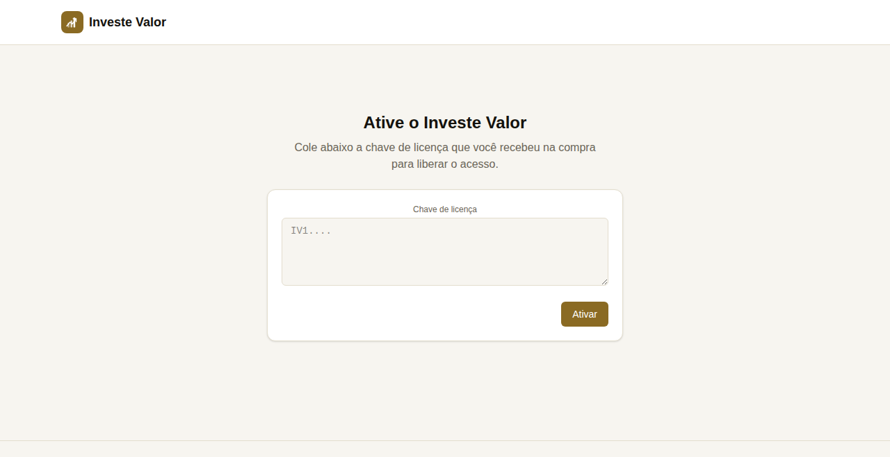
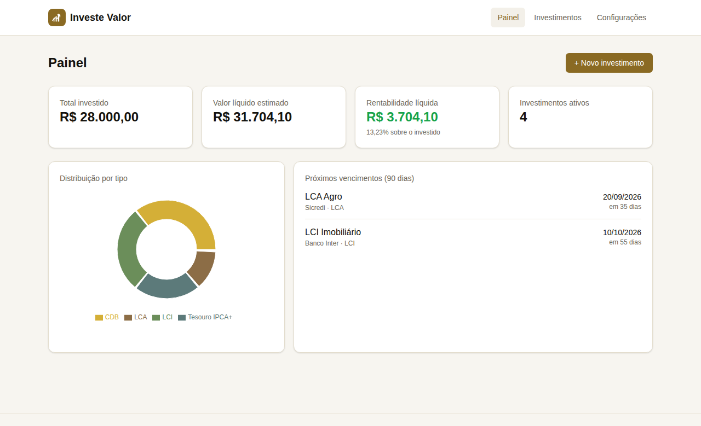
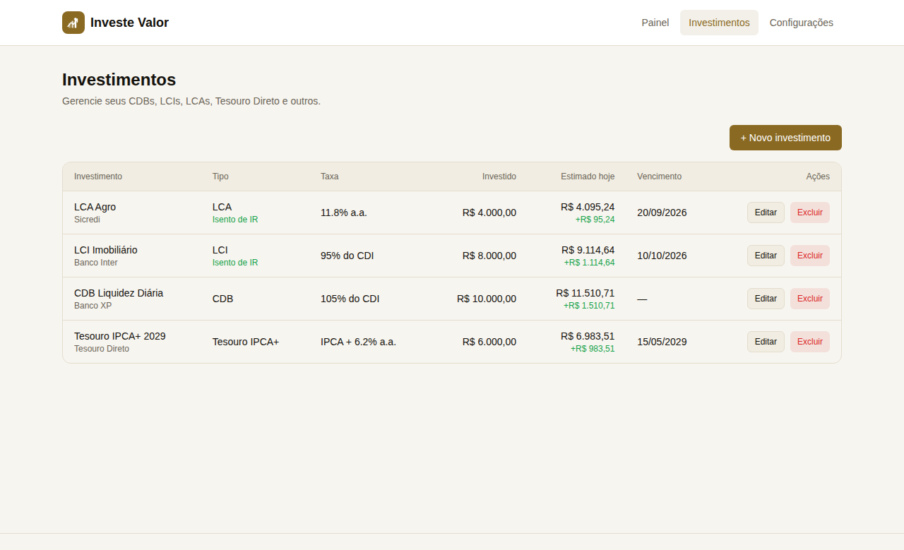
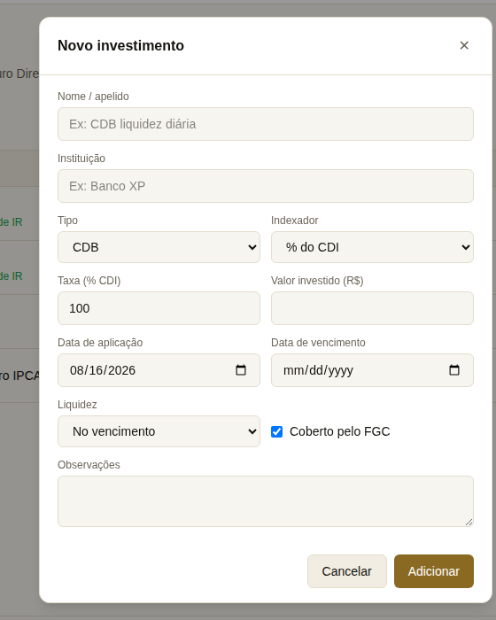
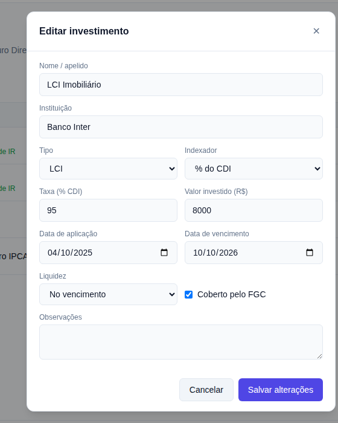
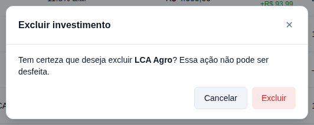
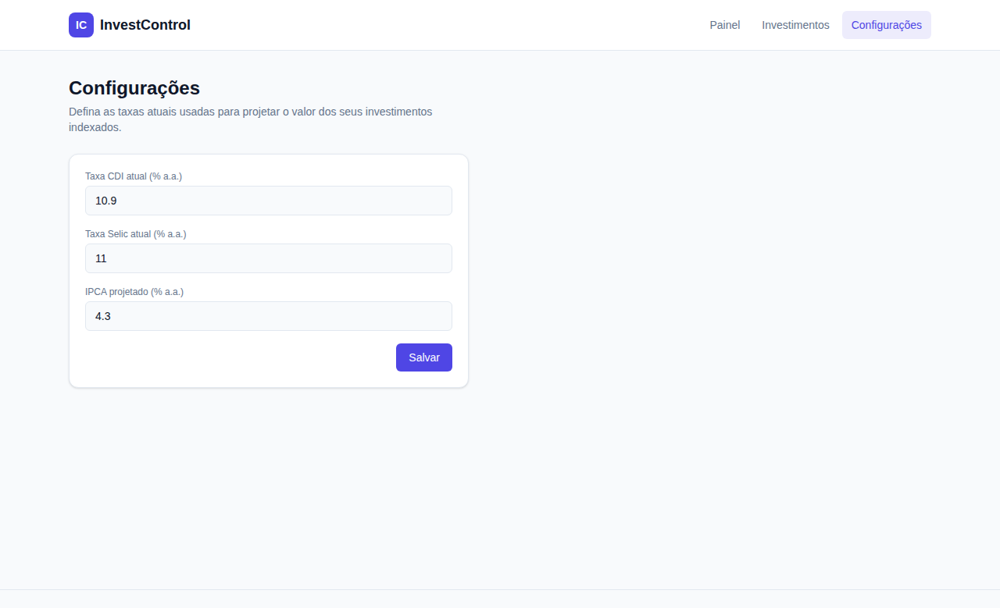

# Manual do Usuário — Investe Valor

Guia de uso do Investe Valor: o painel onde você registra seus investimentos de renda fixa — CDB, LCI, LCA, LC, Tesouro Direto e Poupança — e acompanha, em um só lugar, quanto cada um vale hoje.

> Este manual também está disponível em versão navegável, com capturas de tela maiores: veja o link publicado na conversa que gerou este documento, ou consulte as imagens em [`docs/screenshots/`](./screenshots).

## Sumário

1. [Visão geral](#1-visão-geral)
2. [Ativação](#2-ativação)
3. [Segurança dos dados](#3-segurança-dos-dados)
4. [Painel](#4-painel)
5. [Investimentos](#5-investimentos)
6. [Tipos e indexadores](#6-tipos-e-indexadores)
7. [Como o cálculo funciona](#7-como-o-cálculo-funciona)
8. [Configurações](#8-configurações)
9. [Perguntas frequentes](#9-perguntas-frequentes)

## 1. Visão geral

Três telas resolvem o essencial: o **Painel**, onde você enxerga a carteira toda; **Investimentos**, onde você cadastra e edita cada aplicação; e **Configurações**, onde ficam as taxas de referência (CDI, Selic, IPCA) usadas nos cálculos.

Todo o cadastro fica salvo, de forma cifrada, no banco de dados local da aplicação — nada é enviado ao seu banco ou corretora. Os valores mostrados são **estimativas** calculadas a partir da taxa contratada e das taxas de referência que você informa; eles servem para acompanhamento e planejamento, não substituem o extrato oficial da instituição financeira.

## 2. Ativação

Na primeira vez que você abrir o Investe Valor, ele pede uma chave de licença antes de liberar qualquer tela.

Cole no campo a chave que você recebeu na compra — uma string longa começando com `IV1.` — e clique em **Ativar**. A validação acontece localmente, sem precisar de internet, e a chave fica guardada na sua instalação: você só precisa ativar uma vez.

Se a chave for inválida, estiver expirada, ou não tiver sido informada ainda, o app volta para essa tela e bloqueia o acesso ao Painel, Investimentos e Configurações. Depois de ativado, os dados da licença (nome, e-mail e validade) ficam visíveis na aba [Configurações](#8-configurações).

## 3. Segurança dos dados

O Investe Valor grava os campos sensíveis de cada investimento — **nome, instituição, taxa, valor investido e observações** — cifrados com **AES-256-GCM** antes de tocar o banco de dados. Quem tiver acesso direto ao arquivo do banco, sem a chave de criptografia, não consegue ler esses valores.

Ficam em texto plano apenas o tipo, o indexador, as datas de aplicação/vencimento, a liquidez e a cobertura do FGC — usados para filtrar, ordenar e destacar vencimentos na tela, e de baixa sensibilidade isoladamente (sem o valor, saber que existe "um CDB com vencimento em outubro" não expõe muita coisa).

> A chave de criptografia (`ENCRYPTION_KEY`) é configurada por quem instala e roda a aplicação — veja as instruções no README do projeto. Guarde-a com cuidado: **sem ela, os dados já salvos ficam irrecuperáveis**; se ela vazar, quem a tiver consegue decifrar os dados.

## 4. Painel

É a tela inicial. Ela resume a carteira inteira em quatro números e dois painéis de apoio.

- **Total investido** — soma do valor aplicado (principal) em todos os investimentos ativos.
- **Valor líquido estimado** — quanto a carteira valeria hoje se todos os investimentos fossem resgatados agora, já descontando IR e IOF quando aplicáveis.
- **Rentabilidade líquida** — a diferença entre os dois números acima, em reais e em percentual sobre o total investido.
- **Investimentos ativos** — quantidade de aplicações cadastradas.

O gráfico de **distribuição por tipo** agrupa o valor líquido estimado por categoria (CDB, LCI, LCA…), para você ver rapidamente onde a carteira está concentrada. A lista de **próximos vencimentos** mostra o que vence nos próximos 90 dias, ordenado por data.

## 5. Investimentos

Aqui você cadastra, edita e remove cada aplicação. A tabela já mostra o valor estimado de cada linha, atualizado a cada visita.

### Adicionar um investimento

Clique em **+ Novo investimento** e preencha o formulário. Ao escolher o **Tipo**, o campo Indexador já vem pré-selecionado com o mais comum para aquele tipo — mas pode ser trocado livremente.

| Campo | Descrição |
|---|---|
| Nome / apelido | Identificador livre para reconhecer a aplicação na lista. |
| Instituição | Banco, corretora ou cooperativa onde o investimento foi feito. |
| Tipo | CDB, LCI, LCA, LC, Tesouro Selic, Tesouro Prefixado, Tesouro IPCA+, Poupança ou Outro. Define se há isenção de IR. |
| Indexador | % do CDI, % da Selic, IPCA + spread fixo, ou taxa Prefixada. |
| Taxa | O número contratado, no formato do indexador — ex: `105` para 105% do CDI, `6,2` para IPCA + 6,2% a.a. |
| Valor investido | O principal aplicado, em reais. |
| Data de aplicação | Quando o dinheiro foi investido; ponto de partida do rendimento. |
| Data de vencimento | Opcional — deixe em branco para liquidez diária sem vencimento fixo. |
| Liquidez | Diária ou no vencimento (informativo). |
| Coberto pelo FGC | Marque se o investimento tem garantia do Fundo Garantidor de Créditos. |
| Observações | Campo livre para anotações. |

### Editar ou excluir

Na tabela, use **Editar** para abrir o mesmo formulário já preenchido, ou **Excluir** para remover a aplicação — a exclusão pede confirmação, pois não pode ser desfeita.

| Editar | Confirmar exclusão |
|---|---|
|  |  |

## 6. Tipos e indexadores

O tipo escolhido determina, sobretudo, se o investimento paga Imposto de Renda.

| Tipo | IR | Observação |
|---|---|---|
| CDB | Tributado | Geralmente % do CDI, mas pode ser prefixado ou IPCA+. |
| LCI | **Isento** | Letra de Crédito Imobiliário. |
| LCA | **Isento** | Letra de Crédito do Agronegócio. |
| LC | Tributado | Letra de Câmbio, emitida por financeiras; segue a tabela do CDB. |
| Tesouro Selic | Tributado | Pós-fixado, alta liquidez — indicado para reserva de emergência. |
| Tesouro Prefixado | Tributado | Taxa de juros fixa conhecida desde a compra. |
| Tesouro IPCA+ | Tributado | Paga inflação + taxa fixa; protege o poder de compra. |
| Poupança | **Isento** | Regra própria (TR + 0,5% a.m.); aproximada aqui pelo indexador Prefixado — ajuste a taxa manualmente para refletir o rendimento real. |

| Indexador | Como a taxa é lida | Exemplo |
|---|---|---|
| % do CDI | Percentual do CDI vigente informado em Configurações | `105` → 105% do CDI |
| % da Selic | Percentual da taxa Selic vigente | `100` → 100% da Selic |
| IPCA + | Spread fixo somado à inflação projetada | `6,2` → IPCA + 6,2% a.a. |
| Prefixado | Taxa anual fixa | `12,5` → 12,5% a.a. |

## 7. Como o cálculo funciona

O valor estimado de cada investimento é recalculado toda vez que você abre a tela, com base na data de hoje (ou na data de vencimento, se ela já tiver passado).

1. **Rendimento bruto** — o período entre a aplicação e hoje é convertido em dias úteis (aproximando pela proporção de 252 dias úteis por ano) e a taxa anual equivalente do indexador é capitalizada sobre esse período.
2. **Imposto de Renda** (tabela regressiva, para CDB, LC e Tesouro Direto):

   | Prazo | Alíquota |
   |---|---|
   | Até 180 dias | 22,5% |
   | 181 a 360 dias | 20,0% |
   | 361 a 720 dias | 17,5% |
   | Acima de 720 dias | 15,0% |

   **LCI, LCA e Poupança são isentos** — o rendimento é somado ao principal sem desconto de IR.
3. **IOF regressivo** — resgates com menos de 30 dias corridos pagam IOF sobre o rendimento (96% no dia 1, caindo até 0% no dia 30), aplicado antes do IR.

> **Isto é uma estimativa.** O cálculo usa uma aproximação de dias úteis e as taxas de referência informadas em Configurações — confira sempre o extrato oficial da instituição antes de decidir um resgate.

## 8. Configurações

As três taxas de referência usadas em todos os cálculos ficam centralizadas aqui. Atualize-as sempre que o Copom mudar a Selic (o que arrasta o CDI junto) ou quando a projeção de inflação mudar.

Como o CDI normalmente fica pouco abaixo da Selic, uma atualização vale para toda a carteira de uma vez — não é preciso editar investimento por investimento.

## 9. Perguntas frequentes

**Perdi minha chave de licença. E agora?**
Fale com quem vendeu o Investe Valor para você — a chave pode ser reenviada a qualquer momento, já que ela não expira sozinha (a menos que tenha sido emitida com validade definida).

**Preciso ativar de novo se eu reinstalar ou trocar de computador?**
Sim. A ativação fica registrada apenas na instalação atual (arquivo `license.key`); reinstalar ou migrar para outra máquina exige colar a chave de novo na tela de ativação.

**Os meus dados ficam salvos onde?**
No banco de dados da própria aplicação, local ao ambiente onde ela está rodando. Nenhuma informação é enviada a bancos, corretoras ou terceiros, e os campos sensíveis ficam cifrados (veja [Segurança dos dados](#3-segurança-dos-dados)).

**O que acontece se eu perder a chave de criptografia?**
Os investimentos já cadastrados ficam irrecuperáveis — a chave não fica salva em nenhum lugar recuperável por design. Guarde-a em um cofre de senhas ou local seguro, separado do banco de dados.

**Por que o valor estimado muda de um dia para o outro sem eu fazer nada?**
Porque o cálculo usa a data de hoje como referência — a cada dia que passa, mais rendimento é acumulado sobre o principal.

**Posso cadastrar um investimento sem data de vencimento?**
Sim. É o caso comum de Tesouro Selic e CDBs com liquidez diária — deixe o campo em branco.

**O que acontece com o cálculo depois que o investimento vence?**
O Investe Valor trava o rendimento na data de vencimento — ele não continua rendendo indefinidamente depois de vencido.

**Como sei se um investimento é isento de IR?**
A tabela de investimentos mostra a etiqueta "Isento de IR" abaixo do tipo, sempre que o tipo cadastrado for LCI, LCA ou Poupança.
